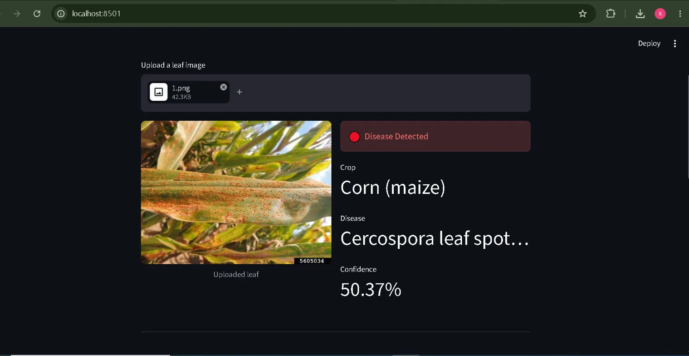

# 🌿 Crop Disease Detection System

An AI-powered web app that detects crop diseases from leaf photos and provides plain-language treatment advice in English and Urdu — built for Pakistani farmers.



## 🎯 What it does
1. User uploads a leaf photo
2. YOLOv8s model identifies the disease (38 disease classes)
3. LLaMA 3 generates treatment advice in English + Urdu

## 🛠️ Tech Stack
- **YOLOv8s** — crop disease classification
- **Groq + LLaMA 3** — plain-language treatment advisory
- **Streamlit** — web interface
- **Python** — backend

## 📊 Model Performance
- Top-1 Accuracy: 99.4%
- Top-5 Accuracy: 99.9%
- Dataset: 70,295 images across 38 disease classes
- Training: 5 epochs on Tesla T4 GPU

## 🌱 Supported Crops
Apple, Blueberry, Cherry, Corn, Grape, Orange, Peach, Pepper, Potato, Raspberry, Soybean, Squash, Strawberry, Tomato

## ⚠️ Known Limitation
Model performs best on clear, close-up leaf photos with simple backgrounds. Real-world field photos may reduce accuracy — a known challenge called the lab-to-field gap. Future work includes fine-tuning with field data collected from Pakistani farmers.

## 🚀 How to Run
```bash
git clone https://github.com/Shahbazbalti60/crop-disease-detector
cd crop-disease-detector
pip install -r requirements.txt
```

Add your Groq API key to `.env`:
Download model weights by training yourself using the notebook in `notebooks/training.ipynb` or contact me at shahbazbalti60@gmail.com for the weights, then run:

```bash
streamlit run app.py
```
